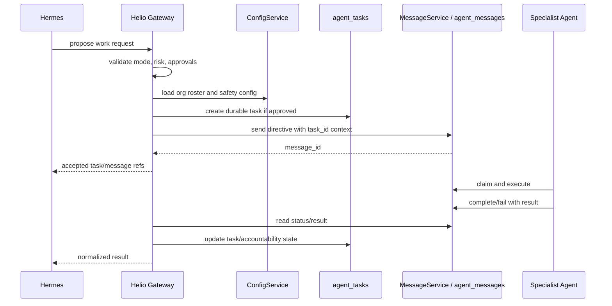

# Canonical Agent Bus Contract

## Status

Phase 6B contract, derived from the implemented `ano-messaging` package.

Primary source candidate:

- `/Users/michaelrinebold/dev/msrresearch/msrresearch/packages/ano-messaging`

Supporting sources:

- `/Users/michaelrinebold/dev/msrresearch/msrresearch/architecture/agent-messaging.md`
- `/Users/michaelrinebold/dev/msrresearch/msrresearch/prds/2026-03-25-1600_ano-portable-messaging-layer.prd.md`
- `/Users/michaelrinebold/dev/msrresearch/msrresearch/prds/2026-03-05-2200_prd-execution-bridge.prd.md`
- `/Users/michaelrinebold/Documents/Codex/2026-05-07/stories-reader-availability-worktree/backend/docs/ano/task-management-and-messaging.md`
- `/Users/michaelrinebold/dev/msrresearch/msrresearch/backend/docs/security/agent-permission-matrix.md`

No Supabase connection was made. No package files were modified.

## Scope

`ano-messaging` is the canonical source for the portable message bus contract:

- `agent_messages`
- `bot_outbound_messages`
- `org_messaging_config`
- config lookup/caching
- outbound bot polling
- directive scanning
- behavioral baseline computation

`ano-messaging` is not a complete task bus package. It does not create or manage `agent_tasks`, `agent_task_events`, approval records, or conversation tables. For Hermes, those remain Helio gateway responsibilities, informed by the PRD Execution Bridge and ANO task/message boundary docs.

## Package Contract

Package metadata:

| Item | Contract |
| --- | --- |
| Package | `ano-messaging` |
| Version | `1.0.0` |
| Python | `>=3.11` |
| Required dependency | `supabase>=2.0` |
| Optional dependencies | `python-telegram-bot>=20.0`, `apscheduler>=3.10` |
| Architecture | dependency injection; caller provides initialized Supabase client |
| Tests in package | none found in package tree |

Exported classes:

| Class | Purpose |
| --- | --- |
| `ConfigService` | Reads org-scoped bus config from `org_messaging_config` with 5-minute cache. |
| `MessageService` | Creates, reads, claims, completes, and fails `agent_messages`. |
| `OutboundService` | Creates, reads, acknowledges, and checks `bot_outbound_messages`. |
| `OutboundPoller` | Polls pending outbound messages and sends via a Telegram bot instance. |
| `DirectiveScanner` | Scans directive text for prompt-injection patterns and optionally logs results. |
| `BaselineService` | Computes and stores per-agent behavioral baselines from `agent_messages`. |

## Canonical Tables

### agent_messages

Purpose: executable inter-agent and agent-human communication queue.

Source DDL: `ano_messaging/migrations/001_agent_messages.sql`, extended by `003_org_scope_and_config.sql`.

| Column | Type | Required | Notes |
| --- | --- | --- | --- |
| `id` | UUID | yes | Primary key, `gen_random_uuid()`. |
| `from_agent` | TEXT | yes | Sender: agent, bot, human, or system participant. Lowercased by service. |
| `to_agent` | TEXT | yes | Target agent or human participant. Lowercased by service. |
| `message_type` | TEXT | yes | Default `directive`; enum below. |
| `payload` | JSONB | yes | Message body; expected shape below. |
| `risk_level` | TEXT | no | Default `read`; enum below. Service package does not auto-classify risk. |
| `status` | TEXT | yes | Default `pending`; enum below. |
| `priority` | INTEGER | yes | Default `5`; range `1..10`, with `1` critical and `10` low. |
| `parent_message_id` | UUID | no | Self-reference for reply/thread chains. |
| `telegram_chat_id` | BIGINT | no | Optional Telegram callback route. |
| `result` | JSONB | no | Execution result written on completion. |
| `error` | TEXT | no | Error text written on failure. |
| `created_at` | TIMESTAMPTZ | yes | Default `now()`. |
| `claimed_at` | TIMESTAMPTZ | no | Set by `claim_agent_message()`. |
| `completed_at` | TIMESTAMPTZ | no | Set by `complete()` or `fail()`. |
| `expires_at` | TIMESTAMPTZ | yes | Default `now() + interval '1 hour'`; service uses 24h for CLI tier payloads. |
| `decision_log_id` | UUID | no | Intended link to `agent_decision_log`; no FK in package migration. |
| `org_id` | TEXT | yes after migration 003 | Default `msr`; added by org-scope migration. |

Enums:

| Field | Values |
| --- | --- |
| `message_type` | `directive`, `query`, `handoff`, `response` |
| `risk_level` | `read`, `write`, `service`, `destructive` |
| `status` | `pending`, `claimed`, `executing`, `completed`, `failed`, `expired`, `cancelled` |

Indexes:

- `idx_agent_messages_to_status` on `(to_agent, status)`
- `idx_agent_messages_from_status` on `(from_agent, status)`
- `idx_agent_messages_parent` on `parent_message_id where parent_message_id is not null`
- `idx_agent_messages_pending_priority` on `(priority, created_at) where status = 'pending'`
- `idx_agent_messages_telegram_chat` on `telegram_chat_id where telegram_chat_id is not null`
- `idx_agent_messages_created` on `created_at`
- `idx_agent_messages_org_status` on `(org_id, to_agent, status)` after migration 003

Helper functions:

| Function | Behavior |
| --- | --- |
| `claim_agent_message(p_message_id UUID, p_agent_name TEXT)` | Atomically sets `status='claimed'` and `claimed_at=now()` only if target matches, status is `pending`, and message has not expired. Returns boolean. |
| `expire_stale_agent_messages()` | Sets expired `pending` and `claimed` messages to `expired`. Returns count. |

### bot_outbound_messages

Purpose: outbound delivery queue from any system to a registered bot.

Source DDL: `ano_messaging/migrations/002_bot_outbound_messages.sql`, extended by `003_org_scope_and_config.sql`.

| Column | Type | Required | Notes |
| --- | --- | --- | --- |
| `id` | UUID | yes | Primary key, `gen_random_uuid()`. |
| `bot_name` | TEXT | yes | Target bot, lowercased by `OutboundService`. |
| `chat_id` | TEXT | yes | Telegram chat ID as string. |
| `message_text` | TEXT | yes | Text to deliver. |
| `parse_mode` | TEXT | no | `Markdown`, `MarkdownV2`, `HTML`, or NULL. |
| `reply_to_message_id` | TEXT | no | Optional Telegram thread/reply target. |
| `status` | TEXT | yes | Default `pending`; enum below. |
| `error` | TEXT | no | Error text on failed delivery. |
| `requested_by` | TEXT | no | Actor that queued the delivery. |
| `created_at` | TIMESTAMPTZ | yes | Default `now()`. |
| `sent_at` | TIMESTAMPTZ | no | Set when delivery is acknowledged as sent. |
| `org_id` | TEXT | yes after migration 003 | Default `msr`; added by org-scope migration. |

Enums:

| Field | Values |
| --- | --- |
| `status` | `pending`, `sent`, `failed` |
| `parse_mode` | `Markdown`, `MarkdownV2`, `HTML`, NULL |

Indexes:

- `idx_bot_outbound_bot_status` on `(bot_name, status) where status = 'pending'`
- `idx_bot_outbound_created` on `created_at`
- `idx_bot_outbound_org_status` on `(org_id, bot_name, status) where status = 'pending'` after migration 003

### org_messaging_config

Purpose: org-scoped agent roster, bot roster, ACL, human roster, and safety config.

Source DDL: `ano_messaging/migrations/003_org_scope_and_config.sql`.

| Column | Type | Required | Notes |
| --- | --- | --- | --- |
| `org_id` | TEXT | yes | Organization identifier. |
| `config_type` | TEXT | yes | Composite primary key with `org_id`; enum below. |
| `config_data` | JSONB | yes | Config payload. |
| `updated_at` | TIMESTAMPTZ | yes | Default `now()`. |

Enums:

| Field | Values |
| --- | --- |
| `config_type` | `agent_roster`, `bot_roster`, `bot_acl`, `human_roster`, `safety_thresholds` |

Config payloads used by `ConfigService`:

```json
{
  "agent_roster": {
    "agents": ["helio", "byte"],
    "human_agents": ["michael"],
    "system_senders": ["email-router"],
    "bot_senders": ["summit"]
  },
  "bot_roster": {
    "bots": ["summit", "laverne"]
  },
  "safety_thresholds": {
    "circuit_breaker_threshold": 5,
    "circuit_breaker_window_minutes": 30,
    "orchestrator_multiplier": 3,
    "orchestrator_agent": "helio",
    "lumen_anomaly_threshold": 10,
    "lumen_anomaly_window_minutes": 5,
    "ops_bot": "lumen",
    "drift_token_stddev": 2.0,
    "drift_rejection_multiplier": 2.0,
    "drift_success_drop_ppts": 10,
    "baseline_window_days": 30,
    "custom_scanner_patterns": []
  },
  "bot_acl": {
    "summit": {
      "allowed_agents": "*",
      "max_risk_level": "service",
      "max_execution_tier": "cli",
      "rate_limit_per_hour": 60,
      "is_internal": true
    }
  }
}
```

### Safety Tables Referenced But Not Created by Package Migrations

The package README and service code reference these tables, and migration 003 adds `org_id` to them if they already exist:

- `agent_circuit_breakers`
- `agent_directive_scans`
- `agent_behavioral_baselines`
- `agent_drift_reports`
- `agent_decision_log`
- `human_participants`

Important contract note: `ano-messaging` does not create these tables in its three packaged migrations. A Helio integration must either confirm the host schema already has them or add a separate safety/governance migration before relying on them.

## Permissions and RLS

Implemented package migrations define:

| Table | Package RLS |
| --- | --- |
| `agent_messages` | RLS enabled. `service_role` full access. `authenticated` read-only select. |
| `bot_outbound_messages` | RLS enabled. `service_role` full access. |
| `org_messaging_config` | RLS enabled. `service_role` full access. |

The portable PRD proposes stricter org isolation using `app.current_org_id`, but the package migrations inspected for Phase 6B do not implement that full per-authenticated-user org policy. For Hermes, direct Supabase access must remain behind Helio. Helio should use server-side credentials only after explicit approval and should enforce org/workspace constraints in its own gateway before any write.

## Message Payload Shape

The package does not enforce a JSON schema for `agent_messages.payload`. The implemented service and README expect this shape:

```json
{
  "directive": "Draft the quarterly report.",
  "context": {
    "task_id": "optional durable task reference",
    "source": "hermes_via_helio",
    "correlation_id": "optional"
  },
  "params": {},
  "execution_tier": "api"
}
```

Observed semantics:

- `directive` is the main instruction text.
- `context` carries structured routing, task, PRD, customer, or handoff metadata.
- `params` is optional and caller-defined.
- `execution_tier='cli'` causes `MessageService.send()` to use a 24-hour expiry by default.
- Absent `execution_tier`, the service uses a 1-hour expiry.
- `MessageService.send()` accepts `parent_message_id` separately for threading.

Hermes contract:

- Hermes must pass work to Helio, not directly to `MessageService`.
- Helio should include `source='hermes_via_helio'`, `hermes_request_id`, and an approval reference when needed.
- Any local file paths, secrets, or credentials must be redacted or represented by approved references before they enter payload JSON.

## Task Payload Shape

`ano-messaging` does not implement `agent_tasks`.

For Hermes-through-Helio work, use the external task/message boundary:

- `agent_tasks` is the durable accountability layer.
- `agent_messages` is the execution and communication layer.
- Message context should reference the task ID once the task exists.

Minimum Helio task payload shape before dispatch:

```json
{
  "task_id": "hermes:<date-or-uuid>:<slug>",
  "agent_name": "helio",
  "task_type": "hermes_dispatch",
  "status": "pending",
  "priority": 5,
  "parent_prd_id": "optional",
  "task_data": {
    "directive": "What Hermes wants done",
    "requested_capability": "backend implementation",
    "requested_agent_hint": "byte",
    "source": "hermes",
    "hermes_request_id": "uuid",
    "approval_id": "optional",
    "risk_level": "read",
    "workspace": "default",
    "org_id": "msr",
    "completion_evidence": "expected artifact or result"
  }
}
```

Helio should then dispatch an `agent_messages` row with `payload.context.task_id` and `payload.context.source`.

## Conversation and Thread Model

Implemented `ano-messaging` has no `conversations` table and no chat-session contract. The only native thread primitive is:

- `agent_messages.parent_message_id`

This supports message/reply chains but not full conversation metadata. For Hermes, Helio should create a normalized `conversation_id` at the gateway layer if the UI or audit model needs one, then store it in:

- `agent_tasks.task_data.conversation_id`
- `agent_messages.payload.context.conversation_id`

Do not rely on `chat_sessions` or `chat_messages` for agent execution unless Helio explicitly maps them into this contract.

## Service Method Contract

### ConfigService

| Method | Contract |
| --- | --- |
| `get_valid_agents(org_id)` | Returns AI agents + humans + system senders + bot senders from `agent_roster`. Empty set if config missing. |
| `get_agent_names(org_id)` | Returns only `agent_roster.agents`. |
| `get_human_agents(org_id)` | Returns only `agent_roster.human_agents`. |
| `get_valid_bots(org_id)` | Returns `bot_roster.bots`. |
| `get_bot_acl(org_id)` | Returns `bot_acl` config or `{}`. |
| `get_safety_thresholds(org_id)` | Returns org config or built-in default thresholds. |
| `invalidate(org_id, config_type=None)` | Clears cache by org/type. |
| `invalidate_all()` | Clears all cached config. |

Caching:

- cache TTL is 300 seconds.
- `_get_config()` returns stale cached data if a refresh fails and a cached entry exists.

### MessageService

| Method | Contract |
| --- | --- |
| `send(from_agent, to_agent, message_type, payload, org_id, telegram_chat_id=None, priority=5, parent_message_id=None, expires_in_hours=None)` | Validates participants and type, checks circuit breaker, inserts `agent_messages`, returns created row. |
| `get_pending(agent_name=None, org_id=None, limit=10)` | Returns pending rows ordered by priority and created time. |
| `claim(message_id, agent_name)` | Calls `claim_agent_message`; returns boolean. |
| `complete(message_id, result_data)` | Sets status `completed`, writes result JSON, sets `completed_at`. |
| `fail(message_id, error)` | Sets status `failed`, truncates error to 2000 chars, sets `completed_at`. |
| `get(message_id)` | Returns one row by ID or `None`. |

Validation:

- `from_agent` and `to_agent` are lowercased and stripped.
- If `ConfigService.get_valid_agents(org_id)` returns a non-empty set, both participants must be in it.
- `message_type` must be one of the package enum values.
- `priority` is clamped to `1..10`.
- Circuit breaker counts bidirectional agent pair messages in a window from `agent_messages`.
- Circuit breaker errors fail open in package code.

### OutboundService

| Method | Contract |
| --- | --- |
| `send(bot_name, chat_id, text, org_id, parse_mode=None, reply_to_message_id=None, requested_by=None)` | Validates bot and parse mode, inserts pending outbound message, returns created row. |
| `get_pending(bot_name, org_id=None, limit=10)` | Returns pending messages for a bot, optionally org-filtered. |
| `ack(message_id, status, error=None)` | Updates pending message to `sent` or `failed`; sets `sent_at` for sent, truncates error. |
| `get_status(message_id)` | Returns delivery status fields or `None`. |

Validation:

- `bot_name` is lowercased and stripped.
- If `ConfigService.get_valid_bots(org_id)` returns a non-empty set, `bot_name` must be in it.
- `text` must be non-empty.
- `parse_mode` must be `Markdown`, `MarkdownV2`, `HTML`, or absent.

### OutboundPoller

| Method | Contract |
| --- | --- |
| `poll_and_send()` | Polls up to 10 pending `bot_outbound_messages`, sends each through the Telegram bot instance, marks sent/failed. |

Behavior:

- Polling is the implemented realtime behavior for outbound delivery.
- Optional `org_id` filters outbound polling by organization.
- In-memory `_delivered_ids` prevents duplicate delivery within the poller process.
- Delivery IDs cache is trimmed after 500 entries.
- Missing `chat_id` or `message_text` marks a message failed.

### DirectiveScanner

| Method | Contract |
| --- | --- |
| `scan(directive, scan_mode='flag', org_id=None)` | Returns `ScanResult`. |
| `scan_and_log(directive, message_id=None, org_id=None)` | Scans and inserts a row in `agent_directive_scans` if a Supabase client is present. |

Types:

```python
ScanResult(
    flagged: bool,
    patterns_matched: list[str],
    scan_result: "clean" | "flagged" | "blocked"
)
```

Scan modes:

| Mode | Behavior |
| --- | --- |
| `off` | Always returns clean. |
| `flag` | Flags matches but does not block. |
| `block` | Returns `blocked` when a blocking category matches. |

Blocking categories:

- `override`
- `role_injection`
- `claude_injection`
- `org_custom`

### BaselineService

| Method | Contract |
| --- | --- |
| `compute_baseline(agent_name, org_id, window_days=30, as_of=None)` | Computes an `AgentBaseline` from `agent_messages`. |
| `upsert_baseline(baseline)` | Upserts to `agent_behavioral_baselines` on conflict `agent_name,baseline_period`. |

Types:

```python
AgentBaseline(
    agent_name: str,
    org_id: str,
    baseline_period: str,
    window_days: int,
    avg_output_tokens: float | None,
    avg_input_tokens: float | None,
    total_messages: int,
    success_rate: float | None,
    rejection_rate: float | None,
    risk_distribution: dict,
    task_type_distribution: dict,
    avg_execution_time_ms: float | None,
    data_points: int,
    computed_at: str,
    insufficient_data: bool
)
```

`insufficient_data` is true when fewer than 5 messages exist in the window.

## Realtime and Subscription Behavior

The package does not implement Supabase Realtime subscriptions or LISTEN/NOTIFY clients.

Implemented behavior:

- `MessageService.get_pending()` polls `agent_messages`.
- `MessageService.claim()` uses the atomic SQL helper.
- `OutboundPoller.poll_and_send()` polls `bot_outbound_messages`.

Supporting architecture docs outside the package describe a civic-main executor worker using LISTEN/NOTIFY plus 5-second fallback polling. That worker behavior is not part of the portable `ano-messaging` package contract.

## Hermes Through Helio Flow



Hermes must not call `MessageService` directly. Helio is the only layer that may translate Hermes work into bus writes.

## Scaffold Decision

Do not implement `services/agent_bus/` in Phase 6B.

The contract is clear enough to propose a scaffold, but not to implement it yet because the Hermes-facing task and approval layers are outside `ano-messaging` and still need a Helio gateway contract.

Safe proposed scaffold for a future approved phase:

```text
services/agent_bus/
  __init__.py
  config.py              # env parsing, fail-closed mode checks
  contracts.py           # local dataclasses for Hermes request/status/result
  helio_gateway.py        # no Supabase; local Helio API/MCP client only
  message_payloads.py     # pure payload builders for agent_messages context
  README.md              # points to docs/AGENT_BUS_CONTRACT.md
tests/
  test_agent_bus_contracts.py
  test_agent_bus_fail_closed.py
```

Initial scaffold rules:

- no Supabase client creation
- no service role handling
- no direct `agent_messages` writes
- no background worker
- no autonomous dispatch
- payload construction tests only
- fail closed when `HELIO_AGENT_BUS_MODE=disabled`

## Open Questions for Phase 6C

- Which Helio endpoint shape should Hermes use: HTTP, MCP, or both?
- Should Helio create `agent_tasks` first for every Hermes request, including read-only queries?
- Which approval table is canonical for Hermes-gated work?
- Should `agent_decision_log` or another audit table be the canonical immutable audit target?
- Should Helio expose a synthetic `conversation_id`, or should Hermes use task/message references only?
- Will Hermes-originated work use `org_id='msr'` and `HELIO_DEFAULT_WORKSPACE=default` until a richer workspace model exists?

