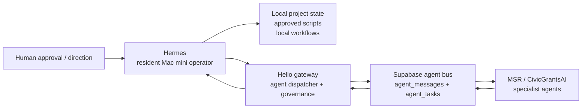

# Hermes + Helio Supabase Agent Bus Plan

Phase 6A defines how Hermes, as the resident Mac mini operator, will use the existing Supabase-backed MSR agent bus through Helio. Hermes must not write directly to Supabase, dispatch agents directly, or bypass Helio governance.

Phase 6B elevates `/Users/michaelrinebold/dev/msrresearch/msrresearch/packages/ano-messaging` as the primary canonical source candidate for the portable message bus. See [Agent Bus Contract](AGENT_BUS_CONTRACT.md).

## Architecture Decision

Hermes owns local Mac mini workflow. Helio owns access to the broader MSR/CivicGrantsAI agent team.

Hermes may inspect local project state and prepare work requests. When the work belongs to the 34-agent team, Hermes submits a governed request to Helio. Helio validates the request, records the task/message state, routes to the right specialist, and returns status/results to Hermes.

## How Hermes Submits Work Requests

Hermes sends a local request to Helio, not directly to Supabase. The first safe interface can be an HTTP or MCP gateway on `127.0.0.1`:

- `POST /agent-bus/tasks/propose`: dry-run task creation and routing recommendation.
- `POST /agent-bus/tasks`: approved task submission.
- `GET /agent-bus/tasks/{id}`: normalized task status.
- `GET /agent-bus/conversations/{id}`: normalized conversation and message history.
- `POST /agent-bus/tasks/{id}/cancel`: approved cancellation path.

Every request from Hermes must include:

- A human-readable directive.
- A requested capability or agent hint, if Hermes has one.
- The local project path or repo context.
- The expected deliverable.
- Risk estimate: `read`, `write`, `service`, or `destructive`.
- Approval reference when the request is not auto-allowable.
- Correlation ID generated by Hermes for audit continuity.

Helio then resolves agent routing against the MSR roster and ACL rules. The portable `ano-messaging` contract expects org-scoped config in `org_messaging_config`; Helio should load or enforce equivalent roster, bot ACL, and safety threshold rules before it writes any bus message. If Hermes asks for a specific specialist, Helio may accept, reroute, or refuse based on governance.

## How Hermes Reads Status and Results

Hermes reads normalized status through Helio. Helio may internally read:

- `agent_tasks` for accountable work state.
- `agent_task_events` or equivalent event history when available.
- `agent_messages` for execution status and results.
- `chat_sessions` / `chat_messages` for conversation history where relevant.
- Audit and approval tables for governance context.

Hermes should receive stable, schema-neutral fields:

- `task_id`
- `conversation_id`
- `status`
- `assigned_agent`
- `last_event`
- `result_summary`
- `result_artifacts`
- `requires_approval`
- `approval_id`
- `audit_ref`

Hermes must not infer success from a message insert. Work is complete only when Helio reports a terminal state such as `completed`, `failed`, `cancelled`, or `expired`.

## Specialist Agent Requests

Hermes can request specialist help in three ways:

- Capability request: "grant research", "backend implementation", "database migration", "QA review".
- Agent hint: "prefer Aster", "consider Byte", "route through Forge if deployment is needed".
- Workflow request: "decompose this into a multi-agent plan".

Helio remains the final router. If the request spans multiple agents, Helio creates the durable task plan and coordinates handoffs. Hermes receives progress snapshots, not raw agent-to-agent chatter unless Helio exposes it as part of the task history.

## Audit Trail Preservation

Each Hermes-to-Helio request needs one correlation chain:

- `hermes_request_id`: generated by Hermes.
- `helio_dispatch_id`: generated by Helio.
- `conversation_id`: groups user/Hermes/Helio messages.
- `agent_task_id`: durable work record.
- `agent_message_id`: execution bus record.
- `approval_id`: required for gated actions.
- `audit_log_id`: immutable governance record.

Helio should log the redacted directive, selected agent, risk level, approval status, and final result. Sensitive local paths or secrets must be redacted before storage.

## Approval Gates

Hermes may directly perform low-risk local inspection already allowed by its Mac mini permission model. The following must route through Helio or require human approval:

| Action | Gate |
| --- | --- |
| Submit read-only specialist question | Helio routing approval, auto-allow if mode permits |
| Ask agent to edit files | Human approval unless covered by explicit session approval |
| Ask agent to run shell commands | Human approval unless command is allowlisted |
| Ask agent to use service credentials | Human approval and audit entry |
| Dispatch multiple agents or start a long-running workflow | Human approval unless pre-approved plan exists |
| Use Google Workspace | Future Google permission/audit framework only |
| Use Home Assistant | Future safety-gated tool layer only |
| Destructive, production, payment, credential, or infrastructure action | Human approval every time |

## Minimum Database Objects Hermes Needs

Hermes does not need direct table access at first, but Helio's bus gateway must normalize at least these objects.

### Conversations

Purpose: group the human request, Hermes planning context, Helio dispatch, and agent replies.

Minimum fields:

- `id`
- `org_id`
- `workspace_id`
- `source`: `hermes`
- `status`
- `created_by`
- `metadata`
- `created_at`
- `updated_at`

Current source candidates: `chat_sessions`, future `conversations`, or a Helio-owned abstraction.

### Messages

Purpose: preserve the request/result conversation and route executable directives.

Minimum fields:

- `id`
- `conversation_id`
- `from_actor`
- `to_actor`
- `message_type`
- `content` or `payload`
- `risk_level`
- `status`
- `parent_message_id`
- `created_at`

Current source candidates: `agent_messages` for executable directives and `chat_messages` only where Helio intentionally maps chat history. `ano-messaging` has no `conversations` table and uses `agent_messages.parent_message_id` as its native thread model. Helio should expose a normalized `messages` view/API rather than requiring Hermes to understand both.

### agent_tasks

Purpose: durable accountable work tracking.

Minimum fields:

- `id` or stable `task_id`
- `org_id`
- `workspace_id`
- `conversation_id`
- `created_by`: `hermes` through `helio`
- `agent_name` or `assigned_agent`
- `task_type`
- `status`
- `priority`
- `risk_level`
- `approval_id`
- `parent_task_id`
- `parent_prd_id`
- `task_data`
- `started_at`
- `completed_at`
- `created_at`
- `updated_at`

Known status model from current PRD bridge sources: `pending -> dispatched -> completed/failed`, with `failed -> dispatched` for retry. `ano-messaging` does not implement `agent_tasks`, so Helio must own task creation and status normalization before exposing task state to Hermes.

### agent_task_events

Purpose: append-only task history. A dedicated table was not found as a canonical DDL source in Phase 6A, but Hermes needs this capability through Helio.

Minimum fields:

- `id`
- `task_id`
- `event_type`
- `actor`
- `status_from`
- `status_to`
- `payload`
- `created_at`

Until a dedicated event table is confirmed, Helio can synthesize events from `agent_messages`, `agent_tasks`, and audit logs.

### Approvals

Purpose: record human approval for gated actions.

Minimum fields:

- `id`
- `requested_by`
- `requested_for`
- `action_type`
- `risk_level`
- `scope`
- `status`
- `decision_by`
- `decision_at`
- `expires_at`
- `metadata`
- `created_at`

The final table may map to an existing approvals table or a Helio-specific approval ledger. Hermes must only store approval references, never raw credentials.

### Audit Logs

Purpose: immutable governance trail.

Minimum fields:

- `id`
- `actor`
- `action`
- `target_type`
- `target_id`
- `risk_level`
- `approval_id`
- `correlation_id`
- `payload_redacted`
- `created_at`

Existing sources include `audit_logs`, `agent_decision_log`, and tool-specific audit tables. Helio should choose the live target and keep Hermes behind the normalized API.

## Required Environment Variables

These variables are declared as planning placeholders only. Real values must stay out of the repo.

| Variable | Purpose | Required when |
| --- | --- | --- |
| `SUPABASE_URL` | Supabase project URL for the Helio bus gateway | Any non-disabled bus mode |
| `SUPABASE_ANON_KEY` | Read-limited Supabase key for safe user-scoped reads, if supported | Read-only/status mode |
| `SUPABASE_SERVICE_ROLE_KEY` | Server-side key for Helio-only writes | Approved dispatch/write mode |
| `HELIO_AGENT_BUS_MODE` | `disabled`, `dry_run`, `read_only`, `propose`, or `execute_with_approval` | Always |
| `HELIO_DEFAULT_ORG` | Default org scope, expected to map to current `org_id` values such as `msr` | Any non-disabled bus mode |
| `HELIO_DEFAULT_WORKSPACE` | Default workspace/project scope for Hermes-originated work | Any non-disabled bus mode |

## Fail-Closed Behavior

Default mode is `disabled`.

If `HELIO_AGENT_BUS_MODE` is missing, empty, or `disabled`, Hermes must not submit, poll, or dispatch bus work. It may draft a request locally and ask for approval to configure the bus.

If `SUPABASE_URL` is missing in a non-disabled mode, Helio must reject startup for the bus gateway.

If `SUPABASE_ANON_KEY` is missing in `read_only` mode, Helio must reject reads instead of falling back to service role credentials.

If `SUPABASE_SERVICE_ROLE_KEY` is missing in `propose` or `execute_with_approval` modes, Helio may perform dry-run validation only. It must not write tasks, messages, approvals, or audit logs.

If `HELIO_DEFAULT_ORG` or `HELIO_DEFAULT_WORKSPACE` is missing, Helio must reject dispatch because org/workspace ambiguity can break ACLs and audit trails.

If any approval check fails, the task remains unsubmitted and Helio returns `requires_approval`.

## Config Layout

Planning-only config should live in existing example env files:

- `config/example.env`: Helio gateway defaults.
- `config/hermes.example.env`: Hermes client placeholders.

Future private values should live in untracked local env files outside version control, for example:

- `config/local/helio.agent-bus.env`
- `~/.hermes/env/agent-bus.env`

## Phase 6B Scaffold Decision

Do not add `services/agent_bus/` yet.

Phase 6B made the portable message contract clear enough to propose a future scaffold, but not to implement it. The missing pieces are task and approval contracts outside `ano-messaging`:

- The canonical `agent_tasks` DDL, including whether `id` or `task_id` is the primary external identifier.
- Whether `agent_task_events` already exists elsewhere or should be created.
- Which existing table is canonical for approvals.
- Which existing table is canonical for immutable audit in this workflow.
- Whether Hermes-originated dispatches should target production-only messaging, following the current MSR `messaging_client.py` pattern.

Future approved scaffold should be Helio-facing only: config parsing, fail-closed mode checks, payload builders, and a local Helio gateway client. It must not create a Supabase client or write directly to `agent_messages`.
